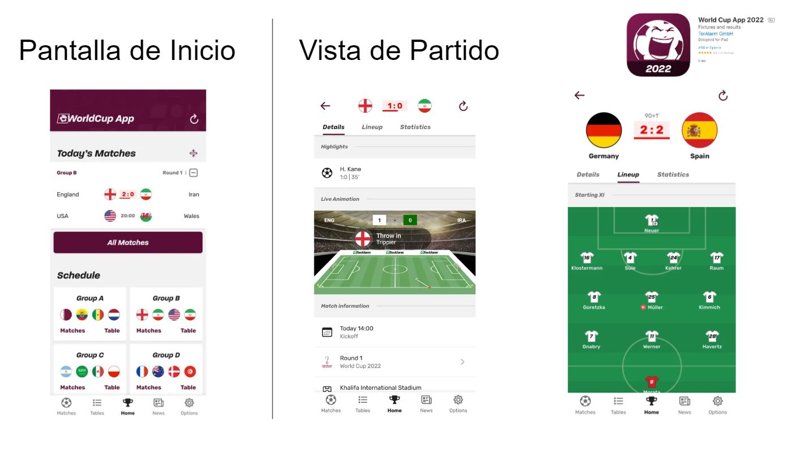
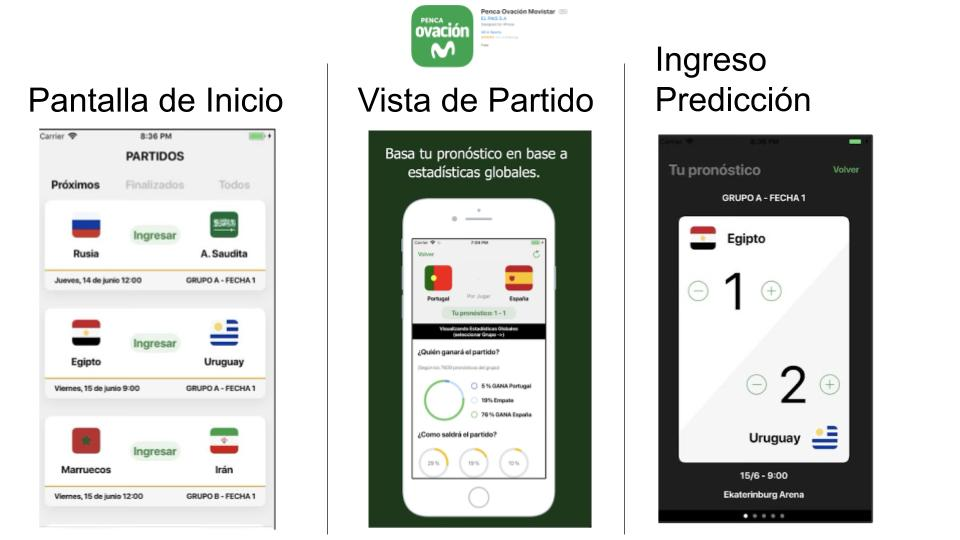

# Informe académico entrega 1
Fecha de entrega: 18-oct-2021

# Repositorio Git

Como parte del proceso de **Ingeniería de Software**, por el lado de procesos de apoyo, utilizaremos una herramienta de ***Software Control Management*** (Gestión de control de software) llamada **Git**.

Está nos permitirá **mantener control** sobre los cambios que ocurran en nuestro proyecto. Aquí se alojaran nuestros elementos de configuración como lo es esta misma documentación.

Git nos permitirá crear repositorios tanto locales como hacer uso de repositorios remotos. Nosotros tendremos nuestro repositorio subido en la pagina web Github, donde cada integrante podrá acceder de forma online a la ultima versión subida de forma remota. Como también subir sus commits locales al repositorio remoto para que otros tengan acceso.

## Comandos Git ejecutados desde terminal y desde el IDE

Para poder hacer uso de esta herramienta hay que tener instalado [Git](https://git-scm.com/) en nuestra computadora.

Nuestro repositorio fue originalmente creador desde Github, por lo que no tendremos que inicializarlo nosotros de forma manual. Pero para poder trabajar en el de forma local debemos obtener una imagen del mismo haciendo uso del siguiente comando desde la terminal

`$ git clone <url>`

Donde \<url\> será el link proporcionado por Github

`$ git clone https://github.com/ORTFIS2022/obligatorio-vazquez-fernandez-salinas.git`
***
Una vez descargado, podemos empezar a realizar cambios en los documentos. En la siguiente sección veremos el porque, pero los cambios en producción serán hechos en otra **rama** llamada develop.

Para saber en que rama estamos trabajando utilizaremos

`$ git branch`

Para acceder a ella utilizaremos el comando:

`$ git checkout develop`

Si esta no existe, la consola nos avisará y podremos crearla con:

`$ git checkout -b develop`

### Nota: git es case-sensitive (sensible a capitalización), por lo que debemos cuidar que ejecutamos.

Por ejemplo:

`$ git checkout -B develop`

Si la rama ya existía, la reinicia.

https://git-scm.com/docs/git-checkout
***

Ya parados sobre la rama develop, podemos hacer cambios en nuestros documentos. Cuando estemos listos para crear una instancia/*snapshot*, de nuestro trabajo debemos realizar un **commit**

En Git tenemos tres areas
1. Working Directory
2. Staging Area (Added)
3. Repositorio (Committed)

Para ver que archivos se modificaron:

`$ git status`

Nuestros archivos modificados se encuentran en el area Working. Por lo que debemos pasarlas al Staging Area usando:

`$ git add .`

Y si estamos seguros realizamos el commit:

`$ git commit -m "Primer commit" `

El *tag* -m seguido de un comentario entre comillas... agrega el comentario.

Finalmente, para que nuestros cambios se vean reflejados en la web de Github. Finalmente haremos:

`$ git push`

Si nos encontramos con algun tipo de error, que nos indique que la rama no existe de forma remota, repetimos el comando anterior de la siguiente forma:

`$ git push --set-upstream origin develop`

Este ultimo push se nos exige para generar una rama visible en el github
***
Luego de completar ciertas metas arbitrarias, o cuando consideremos que nuestro proyecto se encuentra en una etapa sin errores y funcional. Podremos realizar un merge a main, esto es, transferir todo nuestro trabajo de nuestra rama develop a la principal.

Hablaremos más adelante de esto en la sección de versionado.

Para esto nos situaremos en la rama main utilizando:

`$ git checkout main`

Y realizamos el merge con main

`$ git merge develop`

Puede que en durante este proceso tengamos que resolver algún conflicto debido al merge. Teniendo que seleccionar que partes mantener y cuales cambiar entre las dos versiones.

## Conventional commits

A la larga la cantidad de commits realizados crece de forma exponencial, por lo que introduciremos los conventional commits para ordenar un poco nuestro caos.

Esto no es una herramienta especial de Git, ni Github, sino que es algo completamente sintáctico a la hora de generar nuestro comentario.

Previo a la descripción de nuestro commit, haremos uso de distintos *tags*, presentados a continuación:

### docs
`git commit -m "docs: Conventional commits"`
Este hará referencia a cambios en la documentación.

### feat
Introduce una *feature* (funcionalidad) al programa
### fix
Arregla errores
### style
Se realizaron cambios en el estilo, cambios que no afecten la funcionalidad final

https://www.conventionalcommits.org/en/v1.0.0/#specification
https://gist.github.com/qoomon/5dfcdf8eec66a051ecd85625518cfd13

Estos son **algunos** de los que estaremos usando en nuestro proyecto, que se pueden encontrar normalmente en proyectos.

Siendo que esto es simplemente texto, si nuestra organización así lo necesite, puede inventar su propia convención.

# Versionado

Buenas prácticas de versionado

Uso de ramas separadas de 'main'

Resumen de commits y evolución del proyecto

# Elicitación

Técnicas de elicitación utilizadas:  
1. Entrevista
2. Cuestionario
3. Ingeniería Reversa

### Entrevista:  
Que es

### Cuestionario:
Que es

### Ingeniería Reversa:
Se basa en el análisis actual del mercado, se observa como otros han implementado ideas similares; y en base a esto se destacan características esenciales.
***
## Etapas y posibles preguntas guía para la entrevista (10 minutos)

### Etapa 1: Introducción casual

¿Es el fútbol uno de tus intereses? / ¿Te interesa el fútbol?  
En caso de serlo, ¿Cómo manifiestas tu interés hacía el mismo?  
¿Cómo lo disfrutas?  
¿Estás al tanto del comienzo del mundial?  
¿Qué tipo de comportamientos, o prácticas tienen los fanáticos en este tipo de eventos?  
¿Estás familiarizado con el concepto de fixture? De ser así, explicando con tus palabras… ¿Qué es el mismo?  
¿Alguna vez utilizaste alguno? ¿Solo, con amigos, o familiares?
***
### Etapa 2: Introducción a la aplicación

¿Conoces la existencia de las aplicaciones de fixture?  
¿Has usado alguna vez una?  
¿Qué cosas crees que es esencial que las mismas contengan?  
¿Qué emociones experimentas?   
¿Sentís competitividad/rivalidad?   
¿Cuáles son tus motivos para utilizarlas?  
¿Qué obtienes a cambio?  
¿Hay algo que no te agrade de estas aplicaciones  

## Se ha realizado la entrevista:
* [Resultados](investigacion/README.md)

***
## Preguntas del Cuestionario (4-8 Minutos)

1. ¿Estás interesado en el futbol?
    - [ ] Si
    - [ ] No

2. ¿Cómo calificarías tu interés?  <!-- Esto filtra la importancia del requerimiento -->
    - [ ] 1 (Alto)
    - [ ] 2
    - [ ] 3
    - [ ] 4
    - [ ] 5 (Bajo)

3. ¿Qué conoces como Fixture / Penca?

| Inserte texto |
| ------------- |

4. ¿Qué te gusta de las apps de Fixture / Penca actuales?

| Inserte texto |
| ------------- |

5. ¿Qué NO te gusta de las apps actuales?

| Inserte texto |
| ------------- |

6. ¿Qué consideras es un buen incentivo o recompensa para su uso?

| Inserte texto |
| ------------- |

---

* [Transcripción](investigacion/README.md)

***
## Ingeniería Reversa

Hemos analizado dos aplicativos populares en el mercado iOS:
(Las imágenes pueden variar según el dispositivo, el análisis fue hecho sobre un iPhone 8)

[World Cup App](https://apps.apple.com/uy/app/world-cup-app-2022/id793118251)  
 

[Penca Ovación Movistar](https://apps.apple.com/uy/app/penca-ovaci%C3%B3n-movistar/id1357606778) 

Pantalla de Inicio:  
World Cup App
* Se visualizan los partidos actuales o más próximos a las fechas.
* Permite ir rápidamente a ver el resto de partidos, ya sean previos o futuros.
* Permite también, ver los siguientes partidos clasificados por los grupos de países.

Penca Ovación Movistar
* Lista ordenada de los próximos partidos, con información sobre la fecha de juego y grupo al que pertenece el partido. 

Vista detallada de un partido:  
World Cup App
* Score actual ubicado en la parte superior, siendo lo primero a ver por el usuario.
* Información adicional se provee tal como lesiones, goles y demás.

Penca Ovación Movistar
* Visualización clara de los contrincantes
* Permite hacer ingreso de una predicción
* Estadísticas sobre los pronósticos de otras personas

Ingreso de Predicción:  
World Cup App
* No tiene

Penca Ovación Movistar
* Aspecto sencillo, como el resto de la app.
* Tipografías grandes, agregan facilidad al usuario al interactuar con la app.

***

Evidencia de actividades de investigación

Referencias a fuentes de información

Caracterización de usuarios: User Personas

Modelo conceptual del problema

# Especificación

Definición de requerimientos funcionales y no funcionales

User Stories / Use Cases detallados

Bocetos de IU

# Validación y verificación

Verificar la especificación

Validar la solución con personas no involucradas en el proyecto

# Reflexión

Detalle del trabajo individual

Técnicas aplicadas y aprendizajes