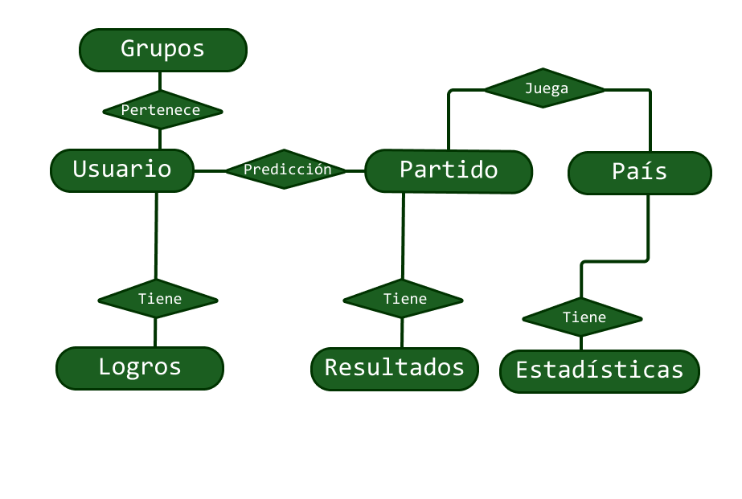
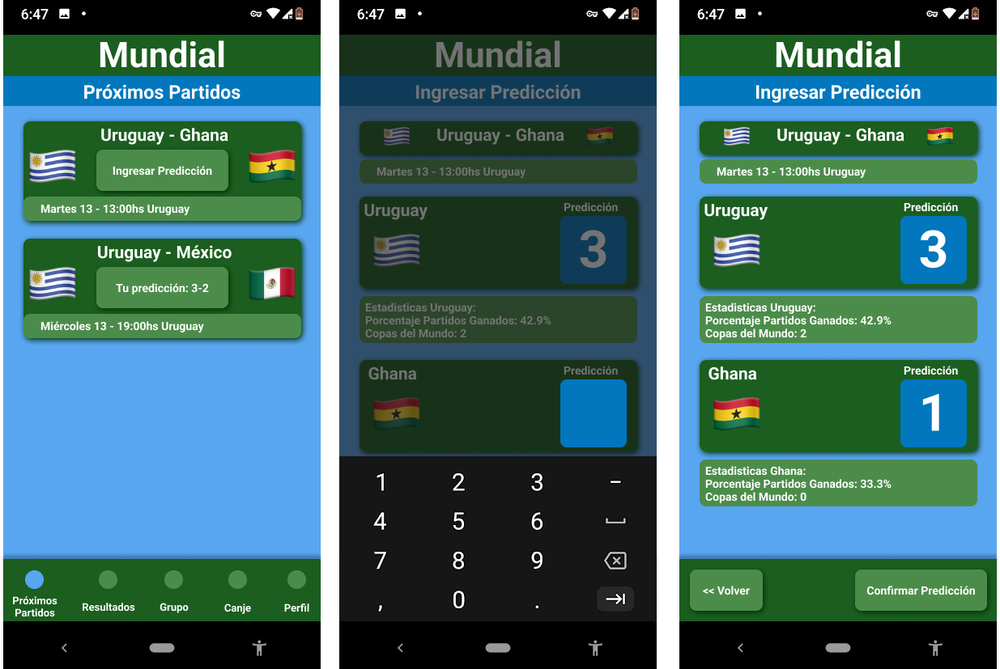

# Informe académico entrega 1
# Repositorio Git

Como parte del proceso de **Ingeniería de Software**, por el lado de procesos de apoyo, utilizaremos una herramienta de ***Software Control Management*** (Gestión de control de software) llamada **Git**.

Está nos permitirá **mantener control** sobre los cambios que ocurran en nuestro proyecto. Aquí se alojaran nuestros elementos de configuración como lo es esta misma documentación.

Git nos permitirá crear repositorios tanto locales como hacer uso de repositorios remotos. Nosotros tendremos nuestro repositorio subido en la pagina web Github, donde cada integrante podrá acceder de forma online a la ultima versión subida de forma remota. Como también subir sus commits locales al repositorio remoto para que otros tengan acceso.

## Comandos Git ejecutados desde terminal y desde el IDE

Para poder hacer uso de esta herramienta hay que tener instalado [Git](https://git-scm.com/) en nuestra computadora.

Nuestro repositorio fue originalmente creado desde Github, por lo que no tendremos que inicializarlo nosotros de forma manual. Pero para poder trabajar en el de forma local debemos obtener una imagen del mismo haciendo uso del siguiente comando desde la terminal

`$ git clone <url>`

Donde \<url\> será el link proporcionado por Github

`$ git clone https://github.com/ORTFIS2022/obligatorio-vazquez-fernandez-salinas.git`
***
Una vez descargado, podemos empezar a realizar cambios en los documentos. En la siguiente sección veremos el porque, pero los cambios en producción serán hechos en otra **rama** llamada develop.

Para saber en que rama estamos trabajando utilizaremos

`$ git branch`

Para acceder a ella utilizaremos el comando:

`$ git checkout develop`

Si esta no existe, la consola nos avisará y podremos crearla con:

`$ git checkout -b develop`

### Nota: git es case-sensitive (sensible a capitalización), por lo que debemos cuidar que ejecutamos.

Por ejemplo:

`$ git checkout -B develop`

Si la rama ya existía, la reinicia.

https://git-scm.com/docs/git-checkout
***

Ya parados sobre la rama develop, podemos hacer cambios en nuestros documentos. Cuando estemos listos para crear una instancia/*snapshot*, de nuestro trabajo debemos realizar un **commit**

En Git tenemos tres areas
1. Working Directory
2. Staging Area (Added)
3. Repositorio (Committed)

Para ver que archivos se modificaron:

`$ git status`

Nuestros archivos modificados se encuentran en el area Working. Por lo que debemos pasarlas al Staging Area usando:

`$ git add .`

Y si estamos seguros realizamos el commit:

`$ git commit -m "Primer commit" `

El *tag* -m seguido de un comentario entre comillas... agrega el comentario.

Finalmente, para que nuestros cambios se vean reflejados en la web de Github. Finalmente haremos:

`$ git push`

Si nos encontramos con algún tipo de error, que nos indique que la rama no existe de forma remota, repetimos el comando anterior de la siguiente forma:

`$ git push --set-upstream origin develop`

Este ultimo push se nos exige para generar una rama visible en el github
***
Si un compañero, o nosotros mismos tenemos el clon del git desde otro computador, podemos obtener la ultima version subida a github haciendo:

`$ git pull`
***
A lo largo del proyecto podremos chequear estos commits y sus hashes asociados con el comando

`$ git log`

***
Luego de completar ciertas metas arbitrarias, o cuando consideremos que nuestro proyecto se encuentra en una etapa sin errores y funcional. Podremos realizar un merge a main, esto es, transferir todo nuestro trabajo de nuestra rama develop a la principal.

Hablaremos más adelante de esto en la sección de versionado.

Para esto nos situaremos en la rama main utilizando:

`$ git checkout main`

Y realizamos el merge con main

`$ git merge develop`

Puede que en durante este proceso tengamos que resolver algún conflicto debido al merge. Teniendo que seleccionar que partes mantener y cuales cambiar entre las dos versiones.

## Conventional commits

A la larga la cantidad de commits realizados crece de forma exponencial, por lo que introduciremos los conventional commits para ordenar un poco nuestro caos.

Esto no es una herramienta especial de Git, ni Github, sino que es algo completamente sintáctico a la hora de generar nuestro comentario.

Previo a la descripción de nuestro commit, haremos uso de distintos *tags*, presentados a continuación:

### docs
`git commit -m "docs: Conventional commits"`
Este hará referencia a cambios en la documentación.

### feat
Introduce una *feature* (funcionalidad) al programa
### fix
Arregla errores
### style
Se realizaron cambios en el estilo, cambios que no afecten la funcionalidad final

https://www.conventionalcommits.org/en/v1.0.0/#specification
https://gist.github.com/qoomon/5dfcdf8eec66a051ecd85625518cfd13

Estos son **algunos** de los que estaremos usando en nuestro proyecto, que se pueden encontrar normalmente en proyectos.

Siendo que esto es simplemente texto, si nuestra organización así lo necesite, puede inventar su propia convención.

# Versionado

> "Un control de versiones es un sistema que registra los cambios realizados en un archivo o conjunto de archivos a lo largo del tiempo, de modo que puedas recuperar versiones específicas más adelante."
> (Pro Git - About Version Control, https://git-scm.com/book/en/v2/Getting-Started-About-Version-Control)

## Buenas prácticas de versionado

Para realizar el versionado de nuestro trabajo utilizamos Git, un sistema de control de versiones distribuido que nos permite tener repositorios locales completamente funcionales, los cuales son clones del proyecto (situado en un repositorio remoto), lo cual facilita el trabajo simultáneo, mantener un registro de los cambios realizados por cada integrante, así como la opción de volver hacia atrás.
A esta herramienta se le suma Github, la cual es una plataforma donde se puede guardar la documentación de los proyectos online (repositorio remoto).

## Uso de ramas separadas de "main"

Una rama es una "copia" de nuestro proyecto en la cual podemos realizar cambios sin afectar a la rama principal; para luego poder fusionarlas y tener un historial de cambios más limpio. Es una función esencial en este tipo de proyectos, ya sea para agregar funciones o arreglar errores, y así evitar que código inestable se fusione con el código base principal.
En nuestro caso utilizaremos dos ramas: main y develop. La rama main aloja las versiones estables del proyecto (que no están en constante cambio), mientras que develop es la de uso diario sobre la que trabajaremos de forma continua.

## Resumen de commits y evolución del proyecto

Para ver el historial de commits completo se puede acceder a https://github.com/ORTFIS2022/obligatorio-vazquez-fernandez-salinas/commits/main  
Pero aquí dejamos unos pocos commits como resumen:  

# Glosario   
Fixture: Un fixture es todo el conjunto de partidos que se juegan entre los equipos durante un campeonato o temporada. Comúnmente asociado a hacer uso de esta información al realizar apuestas sobre los diferentes posibles resultados finales.    
Penca: Una penca es un juego de apuestas donde se busca adivinar un resultado final.   
Predicción: Anunciar un posible resultado del futuro.   
Aplicación de fixture: Aplicación la cual permite realizar diferentes apuestas de forma más tecnológica.   
Estadística: Determinar los diferentes valores de un algo, en base a una o diferentes características.   
Canje: Intercambio de objetos, o cosas, no necesariamente de la misma índole.
Usuario: Persona que utiliza la aplicación.   

# Elicitación
Técnicas de elicitación utilizadas:  
Entrevista: Una entrevista es una reunión entre dos personas, donde se realizan una secuencia de preguntas, cuya respuesta será de ayuda para resolver asuntos relacionados al negocio, o las características de software a desarrollar.

Encuesta: Una encuesta es un formulario con preguntas, el cual se presenta a un grupo de personas para que el mismo lo complete, con el objetivo de desarrollar la solución a un problema en base a las mismas.

Ingeniería inversa: La ingeniería inversa es un proceso en cual se observa la construcción, diseño, y demás características de un producto ya construido, para así crear uno igual.

User Persona: Los User Persona son un modelo ficticio de usuarios, que ayuda a generar una idea general de los motivos, necesidades, frustraciones, hábitos que tiene el mismo, y así poder ofrecer un producto que se adapte a todas esas características.

## Etapas y posibles preguntas guía para la entrevista (10 minutos)
### Etapa 1: Introducción casual

¿Es el fútbol uno de tus intereses? / ¿Te interesa el fútbol?  
En caso de serlo, ¿Cómo manifiestas tu interés hacía el mismo?  
¿Cómo lo disfrutas?  
¿Estás al tanto del comienzo del mundial?  
¿Qué tipo de comportamientos, o prácticas tienen los fanáticos en este tipo de eventos?  
¿Estás familiarizado con el concepto de fixture? De ser así, explicando con tus palabras… ¿Qué es el mismo?  
¿Alguna vez utilizaste alguno? ¿Solo, con amigos, o familiares?
***
### Etapa 2: Introducción a la aplicación

¿Conoces la existencia de las aplicaciones de fixture?  
¿Has usado alguna vez una?  
¿Qué cosas crees que es esencial que las mismas contengan?  
¿Qué emociones experimentas?   
¿Sentís competitividad/rivalidad?   
¿Cuáles son tus motivos para utilizarlas?  
¿Qué obtienes a cambio?  
¿Hay algo que no te agrade de estas aplicaciones  

## Se ha realizado la entrevista:
* [Transcripción](investigacion/README.md)

***
## Preguntas del Cuestionario (4-8 Minutos)

1. ¿Estás interesado en el futbol?
    - [ ] Si
    - [ ] No

2. ¿Cómo calificarías tu interés?  <!-- Esto filtra la importancia del requerimiento -->
    - [ ] 1 (Alto)
    - [ ] 2
    - [ ] 3
    - [ ] 4
    - [ ] 5 (Bajo)

3. ¿Qué conoces como Fixture / Penca?

| Inserte texto |
| ------------- |

4. ¿Qué te gusta de las apps de Fixture / Penca actuales?

| Inserte texto |
| ------------- |

5. ¿Qué NO te gusta de las apps actuales?

| Inserte texto |
| ------------- |

6. ¿Qué consideras es un buen incentivo o recompensa para su uso?

| Inserte texto |
| ------------- |

---

* [Resultados](investigacion/README.md)

***
## Ingeniería Reversa

Hemos analizado dos aplicativos populares en el mercado iOS:
(Las imágenes pueden variar según el dispositivo, el análisis fue hecho sobre un iPhone 8)

[World Cup App](https://apps.apple.com/uy/app/world-cup-app-2022/id793118251)  
 

[Penca Ovación Movistar](https://apps.apple.com/uy/app/penca-ovaci%C3%B3n-movistar/id1357606778) 

Pantalla de Inicio:  
World Cup App
* Se visualizan los partidos actuales o más próximos a las fechas.
* Permite ir rápidamente a ver el resto de partidos, ya sean previos o futuros.
* Permite también, ver los siguientes partidos clasificados por los grupos de países.

Penca Ovación Movistar
* Lista ordenada de los próximos partidos, con información sobre la fecha de juego y grupo al que pertenece el partido. 

Vista detallada de un partido:  
World Cup App
* Score actual ubicado en la parte superior, siendo lo primero a ver por el usuario.
* Información adicional se provee tal como lesiones, goles y demás.

Penca Ovación Movistar
* Visualización clara de los contrincantes
* Permite hacer ingreso de una predicción
* Estadísticas sobre los pronósticos de otras personas

Ingreso de Predicción:  
World Cup App
* No tiene

Penca Ovación Movistar
* Aspecto sencillo, como el resto de la app.
* Tipografías grandes, agregan facilidad al usuario al interactuar con la app.

***

## Caracterización de usuarios: User Personas

## Modelo conceptual del problema

# Especificación

## Definición de requerimientos funcionales y no funcionales
## Requerimientos funcionales
### RF1: No Login
Actor: Usuario

Descripción: El sistema debe funcionar sin que el usuario final, se creé una cuenta. Los datos se guardan de forma local.

Prioridad: Alta
***
### RF2: Ver Partidos Próximos 
Actor: Usuario

Descripción: El sistema debe mostrar un listado de los próximos partidos a jugar en la pantalla de inicio.

Prioridad: Alta
***
### RF3: Predicción 
Actor: Usuario

Descripción: El usuario debe ser capaz de insertar una predicción a los próximos partidos.

Prioridad: Alta
***
### RF4: Estadísticas Pre-Predicción
Actor: Usuario

Descripción: El usuario debe estar informado de ciertas estadísticas al momento de realizar la predicción. No todos los usuarios saben cómo juegan ciertos países, por lo que brindar esta información da una mano. Aquellos más metidos en el fútbol, tendrán ventaja de igual forma al saber las estrategias de cada equipo.

Prioridad: Media
***
### RF5: Logros
Actor: Usuario

Descripción: El sistema debe presentarle al usuario, la posibilidad de mostrar sus logros de forma fácil frente a sus pares. Definimos un logro, como un objetivo arbitrario al cual se le asigna un cierto “badge” icono a él.

Prioridad: Media
***
### RF6: Puntos 
Actor: Usuario

Descripción: El sistema debe presentarle al usuario, la posibilidad de mostrar sus puntos de forma fácil. Estos puntos se obtienen según qué tan acertadas han sido las predicciones del usuario.

Prioridad: Alta
***
### RF7: Canjear Puntos 
Actor: Usuario

Descripción: El sistema debe presentar al usuario, la posibilidad de canjear sus puntos en una tienda online, donde la misma podría contener objetos tales como camisetas, figuritas, y de más cosas.

Prioridad: Baja
***
### RF8: Hacer grupo con códigos de amigo (sin login) 
Actor: Usuario

Descripción: El usuario podrá unirse o crear un grupo, haciendo uso de códigos. 

Prioridad: Media
***
## Requerimientos no funcionales
***
***
### RNF1: Especificación de estilo
Descripción: El sistema debe 

https://material.io/resources/color
Nombre de la app: Mundial
Colors primary: Green 900, secondary: Light Blue 800
Font: Roboto
Icons: filled
***
### RNF2: Números grandes.
Descripción: El sistema debe presentar los scores y predicciones en un formato grande, de forma que el usuario pueda ver de forma rápida y clara, sin mucho esfuerzo.
***
### RNF3: Responsive
Descripción: El sistema debe ser tanto web como mobile
***
### RNF4: Minimizar Uso de Ads 
Descripción: El sistema deberá implementar anuncios no intrusivos, para no agobiar al usuario que lo utiliza.
***
### RNF5: Sencilla 
Descripción: El sistema debe ser simple y fácil de utilizar.
***
### RNF6: Navegación 
Descripción: Página única con navegación entre secciones
***
### RNF7: Instantaneidad 
Descripción: El sistema deberá ser rápido en cuanto a la muestra de resultados y entrega de puntos.
***
### RNF8: Material Design Web Components 
Descripción: Uso de librerías de diseño como MDWC

***
***
## User Stories / User Cases detallados
### User Stories 
### US1: 
Título: Partidos  
Requerimiento asociado: RF2  
Narrativa:  
Como usuario  
	Quiero ver los partidos  
	Para estar informado  
Criterios de aceptación:  
	Veo los partidos  
***
### US2:  
Título: Predecir  
Requerimiento asociado: RF3 , RF4
Narrativa:   
Como usuario  
	Quiero predecir el resultado de un partido  
	Para ver que tan acertado estoy  
Criterios de aceptación:   
El usuario ingresa una predicción valida en base a sus conocimientos y las estadísticas otorgadas por el sistema  

***
### US3:
Título: Obtención de puntos  
Requerimiento asociado: RF6  
Narrativa:   
Como usuario  
	Quiero obtener puntos  
	Para luego canjearlos por premios  
Criterios de aceptación:   
	Que el partido haya finalizado y están disponibles los resultados en el panel de resultados.  
***
### US4: 
Título: Crear Grupo  
Requerimiento asociado: RF8  
Narrativa:   
    Como usuario  
	Quiero crear un grupo  
	Para pertenecer a uno  
Criterios de aceptación:   
	El usuario crea un grupo vacío, obteniendo el código de este  

***
### US5: 
Título: Unirse a Grupo  
Requerimiento asociado: RF8  
Narrativa:   
    Como usuario   
	Quiero unirme a un grupo  
	Para pertenecer a uno  
Criterios de aceptación:   
	El usuario se une a un grupo, utilizando el código de este  

***
### US6: 
Título: Ver Grupo  
Requerimiento asociado: RF8  
Narrativa:   
    Como usuario    
	Quiero ver mis grupos    
	Para saber como voy respecto a otros    
Criterios de aceptación:   
	El usuario ver el grupo  

***

### US7:
Título: Status (Ver logros o puntos) 
Requerimiento asociado: RF5 , RF6    
Narrativa:   
Como usuario  
	Quiero ver mis puntos y logros  
	Para mostrarle a sus pares  
Criterios de aceptación:   
	La visualización en pantalla de los puntos y logros del usuario
***
### US8: 
Título: Canje  
Requerimiento asociado: RF7  
Narrativa:   
Como usuario  
	Quiero canjear mis puntos  
	Para obtener un premio físico  
Criterios de aceptación:   
Si el usuario alcanza la cantidad requerida de puntos, podrá recibir un producto a  cambio. Se le otorga un código para cambiar en una tienda afiliada.

***
### User Cases

### UC1:
User story asociado: US1  
**Título:** Ver partidos próximos  
**Actor:** Usuario

**Curso normal:**
| Acción de los actores                        | Respuesta del sistema                                          |
| -------------------------------------------- | -------------------------------------------------------------- |
| 1. Selecciona “Próximos Partidos” (Figura 1) | 2. Muestra los partidos más inmediatos, sus equipos y horarios |

(Figura 1):  

***
### UC2:
User story asociado: US2  
**Título:** Predecir  
**Actor:** Usuario

**Curso normal:**
| Acción de los actores                                                              | Respuesta del sistema                                                        |
| ---------------------------------------------------------------------------------- | ---------------------------------------------------------------------------- |
| 1. Selecciona “Ingresar predicción” en el área de “Próximos partidos” (Figura 2.1) | 2. Muestra un campo de texto para poder ingresar la predicción. (Figura 2.2) |
| 3. Presiona el botón “Confirmar Predicción” (Figura 2.3)                           | 4. Se confirma la predicción                                                 |

(Figura 2): 

***
### UC3:
User story asociado: US3    
**Título:** Obtención de puntos  
**Actor:** Usuario

**Curso normal:**
| Acción de los actores                                | Respuesta del sistema                                             |
| ---------------------------------------------------- | ----------------------------------------------------------------- |
| 1. Selecciona área resultados (Figura 3)             | 2.Muestra los partidos de los cuales ya se conocen los resultados |
| 3. El usuario clickea botón para reclamar sus puntos | 4. El sistema cambia el mensaje del botón a “ya reclamado”        |

**Curso alternativo:**
**2.1** No hay resultados, no muestra nada

**3.1** El usuario no tiene nada para reclamar, porque no ingresó una predicción a ese partido, solo ve el resultado.

**3.2** El usuario ya reclamó previamente sus puntos  

(Figura 3):  

***
### UC4:
User story asociado: US5  
**Título:** Crear un Grupo   
**Actor:** Usuario

**Curso normal:**
| Acción de los actores                    | Respuesta del sistema                                                  |
| ---------------------------------------- | ---------------------------------------------------------------------- |
| 1. Selecciona área "Grupo" (Figura 4.1)  | 2. Muestra los grupos a los que pertenece y arriba dos opciones        |
| 3. Selecciona "Crear grupo" (Figura 4.1) | 4. El sistema pide el ingreso de un nombre (Figura 4.2)                |
| 5. Ingresa un nombre                     | 6. El sistema genera un código único para ese nuevo grupo (Figura 4.3) |
| 5. Vuelve al menu de grupos              | 6. El sistema muestra los grupos (Figura 4.4)                          |

**Curso alternativo:**

**5.1:** El nombre que ingreso es vacío, se pide reingreso.  

(Figura 4):  

### UC5:
User story asociado: US5  
**Título:** Unirse a Grupo    
**Actor:** Usuario

**Curso normal:**
| Acción de los actores                   | Respuesta del sistema                                             |
| --------------------------------------- | ----------------------------------------------------------------- |
| 1. Selecciona área "Grupo" (Figura 5.1) | 2. Muestra los grupos a los que pertenece arriba dos opciones     |
| 3. Selecciona "Unirse a grupo"          | 4. Muestra un campo de texto para ingresar el código (Figura 5.2) |
| 5. Ingresa el código                    | 6. Agrega al usuario al grupo, mostrando el grupo (Figura 5.3)    |

**Curso alternativo:**

**6.1:** El código que ingresó el usuario no pertenece a ningún grupo: se emite el mensaje "Este código no existe", pide reingreso.

(Figura 5):   

### UC6:
User story asociado: US6   
**Título:** Ver Grupo   
**Actor:** Usuario

**Curso normal:**
| Acción de los actores                                   | Respuesta del sistema                                         |
| ------------------------------------------------------- | ------------------------------------------------------------- |
| 1. Selecciona área "Grupo" (Figura 6.1)                 | 2. Muestra los grupos a los que pertenece arriba dos opciones |
| 3. Selecciona uno de los grupos clickeando en la flecha | 5. Muestra el grupo (Figura 6.2)                              |

**Curso alternativo:**

**3.1:** No pertenece a ningún grupo y se le indica.

(Figura 6):   

***
### UC7:
User story asociado: US7  
**Título:** Status (Ver logros o puntos)
**Actor:** Usuario

**Curso normal:**
| Acción de los actores                                           | Respuesta del sistema                                                   |
| --------------------------------------------------------------- | ----------------------------------------------------------------------- |
| 1.Selecciona la opción “Perfil” en el área inferior. (Figura 7) | 2.Muestra el puntaje actual del usuario. Y debajo sus logros acumulados |

**Curso alternativo:**

**2.1** Si no hay logros, el sistema lo indicará

En el área inferior, en la opción “Perfil”, el usuario es capaz de visualizar la cantidad de puntos acumulados en base a sus predicciones, al igual que sus logros.  

(Figura 7):  

***
### UC8:
User story asociado: US8  
**Título:** Canje + Ver artículos disponibles
**Actor:** Usuario

**Curso normal:**
| Acción de los actores                                                                                 | Respuesta del sistema                                         |
| ----------------------------------------------------------------------------------------------------- | ------------------------------------------------------------- |
| 1. Selecciona el área "Canje" (Figura 8.1)                                                            | 2. Muestra una lista con los productos disponibles            |
| 3. Selecciona un producto de la lista para canjearlo o ver su comprobante si ya lo canjeo previamente | 4. Muestra los detalles del producto (Figura 8.2)             |
| 5. Selecciona "Confirmar canje"                                                                       | 6. Muestra código del producto y dirección para ir a buscarlo |

**Curso alternativo:**

**5.1:** El usuario no tiene suficientes puntos: se emite el mensaje "No tienes suficientes puntos"  

**5.2:** El usuario ya lo canjeo previamente, por lo que ira directo a ver el comprobante y lugar de retiro 

(Figura 8):  

# Validación y verificación
Realizamos un reencuentro con la persona entrevistada para presentarle el boceto de las características finales de la aplicación, su feedback fue positivo, sintió que pudimos plasmar las ideas generales que nos comentó a la perfección e ir más allá. 
A nivel grupal sentimos que pudimos obtener los requerimientos que se esperaban para así formar la base de la aplicación.

# Reflexión
## Detalle del trabajo individual

## Santi
A grandes rasgos considero que todo el equipo trabajó muy bien, hay trabajos por fuera de la computadora, como instancias de reunión, charla y puestas a punto que también se dieron y fueron clave para el desarrollo del mismo. Personalmente, trabajé en la escritura de los comandos administré las respuestas del cuestionario y participé de la entrevista que se le realizó a Giuliana; hice el análisis de 2 apps ofrecidas en el mercado; un user persona y las diagramaciones en figma; por último trabajé en el listado de requerimientos e identifique algunos user stories y cases.

## Nati
Al principio trabajamos más de forma individual, separando el trabajo que debía hacer cada uno, mientras que más al final del proyecto trabajamos un poco en conjunto para poner ideas en común.
En particular hice la sección de versionado, el UPersona de Paulina y un par de User Stories y Use Cases. También ayudé un poco a la hora de hacer las preguntas de la entrevista/cuestionario.

## María Noel
Dependiendo las diferentes etapas del proyecto, hubieron tiempos donde se requería el trabajo en conjunto, mientras otras permitían que cada integrante pudiese desarrollarse de forma individual y de forma libre, aunque a pesar de trabajar en esta forma disjunta, siempre se corroboraba y/o checkeaba con el resto del grupo, haciendo que ninguna parte sea totalmente unipersonal. Particularmente, trabajé organizando y reescribiendo las preguntas y etapas guía para la entrevista, participé de la entrevista realizada, y realicé la transcripción de la misma, definí cada una de las técnicas de elicitación utilizadas durante esta primera instancia, aporte mi versión de user persona, al igual que la realización de algunos user cases, y como último desarrolle la verificación final, teniendo en cuenta la persona entrevistada y la opinión de mis compañeros de trabajo.

## Aprendizaje
Durante el proyecto pudimos aprender a utilizar git y github, familiarizarnos con los comandos y el uso de las ramas, ya que no todos teníamos conocimiento al respecto. Además vemos como algo positivo, que nos puede servir para el futuro, las técnicas de elicitación utilizadas y el uso de de User Stories y Use Cases. A grandes rasgos aprendimos la ingeniería de procesos, y más específicamente la parte de requerimientos y cómo extraer los mismos. También quizás no como aprendizaje como tal, pero se reforzaron los diferentes métodos de organización que se utilizan a la hora de trabajar en grupo, como lo es el análisis fuertes y debilidades de cada uno, la distribución equitativa de cada una de las partes y la validación y acuerdo del grupo en cada uno de los pasos dados, por más pequeño que fuese.

## Técnicas aplicadas.
Buenas prácticas de versionado, conventional commits, entrevistas, cuestionarios, user personas, herramientas de diseño (figma).