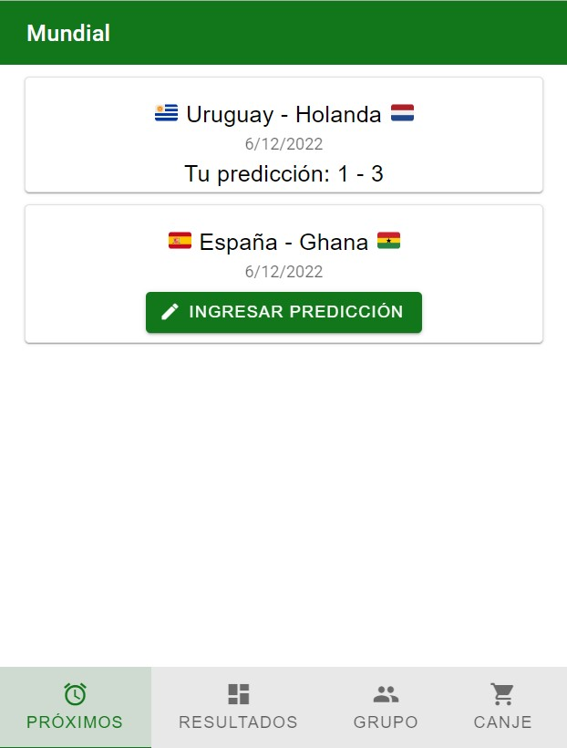
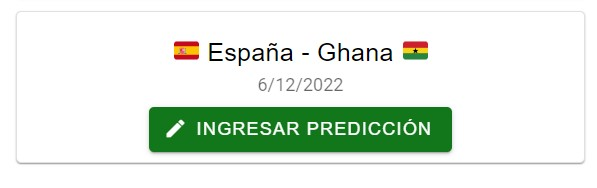
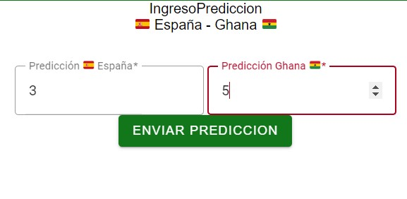
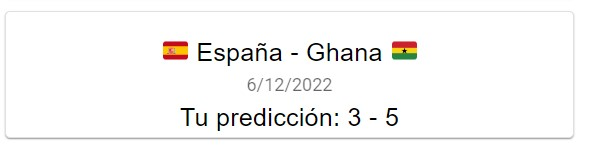
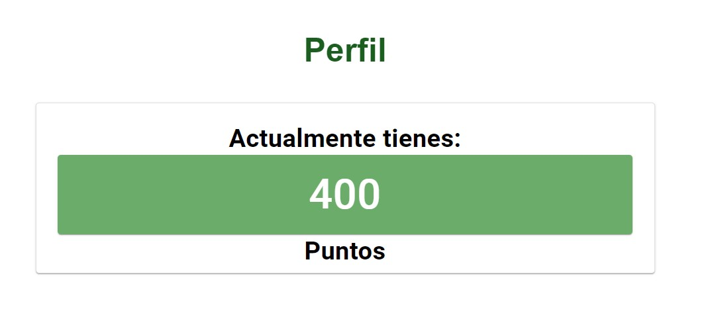

# Informe académico entrega 2
Fecha de entrega: 29-nov-2021

## Construcción

### Implementación de funciones principales (sin la necesidad de persistencia de datos)  
✔️ - RF1: No Login  
✔️ - RF2: Ver Partidos Próximos  
✔️ - RF3: Predicción  
🚫 - RF4: Estadísticas Pre-Predicción  
🚫 - RF5: Logros  
✔️ - RF6: Puntos  
🚫 - RF7: Canjear Puntos  
🚫 - RF8: Hacer grupo con códigos de amigo (sin login)  

✔️ - RNF1: Especificación de estilo  
✔️ - RNF2: Números grandes  
✔️ - RNF3: Responsive  
✔️ - RNF4: Minimizar Uso de Ads  
✔️ - RNF5: Sencilla  
✔️ - RNF6: Navegación  
🚫 - RNF7: Instantaneidad  
✔️ - RNF8: Material Design Web Components  

***

De forma general la aplicación es capaz de moverse a través de las diferentes secciones (Próximos, Resultados, Grupo, Canje, Perfil). Siendo en Próximos, Resultados y Perfil donde hay funciones implementadas.

Los User Cases implementados en esta ocasión fueron 
***
### UserCase 1: Ver partidos próximos
El usuario selecciona "Próximos Partidos" y a continuación se muestran los partidos más inmediatos, sus equipos y horarios.

### UserCase 2: Predecir
El usuario selecciona "Ingresar predicción" en el área de “Próximos partidos”, aparece un campo de texto para ingresar la misma, y se presiona un botón para confirmarla.

### UserCase 3: Obtención de puntos
El usuario selecciona el área "Resultados", se muestran los partidos ya jugados y con su correspondiente resultado, y en el caso de haber ingresado una predicción en el mismo, el sistema muestra un botón para reclamar los puntos.

### UserCase 7: Ver logros o puntos
El usuario selecciona el área "Perfil" y es capaz de visualizar sus puntos resultantes de las predicciones realizadas en partidos ya jugados.
***

### Configuración de plataforma tecnológica para desarrollo y producción

A modo de tene un área de trabajo separada de la versión final del proyecto se creo una rama develop a partir de la rama main. Realizando el merge de las mismas, tal como indicado, al final, donde la aplicación cumplía sus funcionalidades, y se consideraba establecida.

## Interfaz de usuario

### Interfaz de usuario web / mobile (responsive)  
Esto es posible gracias a propiedades de estilo css que se aseguran de que la interfaz sea agradable para el usuario en ambos casos. 

La propiedad de estilo en cuestión es la siguiente:  
` @media only screen and (min-width: 768px) `

### Página única con navegación entre secciones  
Para esto 
Hicimos uso del Material Design Component Tab para llevar a cabo con este requerimiento de navegación. 

Se plantea un ` <section id="Pantalla"> ` que contendrá dentro un ` <section id="nombreSeccion"> ` para cada una de las distintas pantalla.

El efecto de cambio se efectúa con el uso de dos clases scss principales ` .hide ` y ` .show `, que ocultan o muestran el section en pantalla.

### Implementación: Material Design Web Components
Como parte de los requerimientos no funcionales del obligatorio, se han utilizado componentes pre-diseñados ofrecidos por Google. Estos mismos se pueden encontrar en `https://material.io/`.  

Actualmente se publicita el uso de la versión 3 de Material Design, pero esta aún no se encuentra disponible para web. Por lo que para nuestro proyecto usamos la versión 2. `https://m2.material.io/develop/web`

Su uso con node.js es sencillo, se debe seguir la guía del componente a utilizar. Haciendo `npm install componente`, copiando el bloque de html y agregar funcionalidades extra por Javascript.

Dentro de nuestro proyecto se puede hallar el uso de las siguientes dependencias:  
> Cards
> Tab Bar
> Textfield
> Button
### Aplicar un sistema de diseño y principios de usabilidad
Se busca que nuestra aplicación siga los principios de usabilidad planteados por Jakob Nielsen

🚫 1 – Visibilidad del estado del sistema
> Podemos mejorar agregando mensajes directos al usuario, cuando la predicción que ingresa no es valida.

✔️ 2 – Relación entre el sistema y el mundo real
> Los iconos utilizados reflejan un parecido con su nombre  

✔️ 3 – Control y libertad del usuario
> Permitimos al usuario volver hacia atrás cuando entra al menu de ingresar predicción pero aún no esta listo para realizarla.

✔️ 4 – Consistencia y estándares de usabilidad
> El uso de Material Design nos permite mantener un diseño constante y reconocible a simple vista.

✔️ 5 – Prevención de errores en usabilidad  

✔️ 6 – Reconocer antes que recordar  

✔️ 7 – Flexibilidad y eficiencia en el uso
> Hacemos uso de un lenguaje muy básico y nuestra aplicación no tiene muchas opciones por pantalla. Haciendo que sea fácil de usar tanto para expertos, como para novatos en la tecnología.

✔️ 8 – Diseño estético y minimalista  

🚫 9 – Ayudar a los usuarios a reconocer y corregir sus errores
> Podemos mejorar agregando mensajes directos al usuario, cuando la predicción que ingresa no es valida.

🚫 10 – Ayuda y documentación
> Actualmente nuestro sistema no cuenta con documentación sobre su uso.
### Cumplimiento de estándar de accesibilidad WCAG

Hicimos uso de la extensión WAVE de Chrome para analizar nuestra página.

Se encuentran dos errores asociados a los aria-labels que incluían los botones.
Y un warning sobre los tabIndex de nuestra barra inferior, ya que estos arrancan en -1.

Debemos cambiar el idioma del html de EN a ES, para mantener la accesibilidad.

Nuestra página no presenta contrastes incorrectos, facilitando la lectura.
### Seguir especificación de estilo
TODO:

### Emojis
El uso de emojis para sumar color al aplicativo fue mediante el uso de las banderas. Pero notamos que dependiendo del dispositivo del usuario, su experiencia variaría drásticamente, ya que cada dispositivo cuenta con su librería de emojis.

Haciendo que los dispositivos de microsoft no mostraran las banderas. Por lo que optamos por hacer uso de Tweemoji `https://twemoji.twitter.com/` , una librería de emojis Open Source de twitter. Esto le da un look uniforme a nuestro proyecto desde cualquier dispositivo.

## Codificación

### IDE Visual Studio Code: configuración común del equipo
Para la realización del proyecto, el IDE utilizado por el equipo, fue IDE Visual Studio Code en la versión 1.73.1, utilizando extensiones tales como, LiveShare (para aquellos momentos donde era necesario trabajar en conjunto para solucionar problemas, o decidir la implementación de una cierta función) y TodoTree (para dejar marcada tareas para el resto del equipo, o pequeños detalles a arreglar a futuro)

### Estándares de codificación Google (HTML, CSS, JavaScript)
"Un estándar de codificación es una serie de reglas que determinan cómo debe escribirse el código. El objetivo es lograr un código fácil de leer por otros humanos 
Un ejemplo de una regla como esta podría ser «todos los if llevan {} independientemente de que haya una línea dentro del bloque o más de una" - https://academy.leewayweb.com/

Para lograr el correcto uso de los estándares de codificación, se tomaron como base los estándares de codificación de Google, para poder utilizar los mismos, se hizo empleo de ESLint como herramienta de análisis estático de código de JavaScript.
### Buenas prácticas de OOP: separación de lógica e interfaz
A modo de buena práctica de OOP, se separó la lógica de la interfaz.
Por un lado, contamos con la carpeta dominio, la cual incluye la lógica, las clases y los test, y por el otro la carpeta Interfaz, la cual contiene el HTML, el SCSS, y JavaScript

En la carpeta dominio, podemos encontrar las clases
 - partido.js
 - perfil.js
 - sistema.js

al igual que los test
- sistema.test.js

En la carpeta interfaz, podemos hallar
- index.html
- index.js
- _variables.scss
- index.scss

### Análisis estático de código: mostrar reducción de problemas
"Una herramienta de análisis estático escanea el código en busca de errores y vulnerabilidades comunes conocidas, como fugas de memoria o desbordamientos de búfer. El análisis también puede hacer cumplir las reglas de codificación." - https://www.jetbrains.com/

Como ya mencionado anteriormente, se hizo uso de la herramienta esLint.

## Test unitario

### Test unitarios en Jest

### 100% cobertura en clases de dominio

| En la semana previa a la entrega se debe congelar el desarrollo (22-nov-2021).
A partir de este punto solo se realizan actividades de test de sistema, reporte de issues y generación del informe académico.

## Test de sistema

### Realizar test de sistema en un entorno separado del desarrollo
100% cobertura en clases de dominio  
 PASS  ./sistema.test.js  
  V Mi primera prueba (4 ms)  
  V Obtener partido en default (2 ms)  
  V Crear Sistema, puntaje 0 (1 ms)  
  V Establecer puntaje 100 (1 ms)  
  V Establecer puntaje negativo (1 ms)  
  V Estado de partido aun no reclamado (1 ms)  
  V Estado de partido reclamado (1 ms)  
  V Estado de partido fantasma  
  V Prediccion 1 negativa (1 ms)  
  V Prediccion 2 negativa (1 ms)  
  V Prediccion 2 negativa  
  V Estado de la prediccion 1  
  V Estado de la prediccion 2 (1 ms)  
  V Estado del resultado 1 (1 ms)  
  V Estado del resultado 2 (1 ms)  
  V Resultado negativo (1 ms)  
  V Prediccion exacta (10 ms)  
  V Prediccion delta2 (1 ms)  
  V Prediccion delta2 (2 ms)  
  V Obtener Perfil (1 ms)

>
>File        | % Stmts | % Branch | % Funcs | % Lines | Uncovered Line
>------------|---------|----------|---------|---------|----------------
>All files   |     100 |      100 |     100 |     100 |
> partido.js |     100 |      100 |     100 |     100 |
> perfil.js  |     100 |      100 |     100 |     100 |
> sistema.js |     100 |      100 |     100 |     100 |

>Test Suites: 1 passed, 1 total  
>Tests:       20 passed, 20 total  
>Snapshots:   0 total  
>Time:        3.835 s  
>Ran all test suites.  
>

| En la semana previa a la entrega se debe congelar el desarrollo (22-nov-2021).
A partir de este punto solo se realizan actividades de test de sistema, reporte de issues y generación del informe académico.

## Test de sistema
A nuestro equipo se nos ha asignado el siguiente repositorio:
` https://github.com/ORTFIS2022/obligatorio-goday-fernandez-morandi `

Realizar test de sistema en un entorno separado del desarrollo

### Generar casos de prueba aplicando técnica partición equivalente
Al momento de ingresar una predicción se han tomado en cuenta las siguientes particiones

Números Enteros Positivos dentro de un rango normal 0-100:  
✔️ - El sistema actúa de forma normal

Números Enteros Positivos fuera de un rango normal > 100:  
❓ - El sistema acepta números muy grandes, considerando las condiciones reales y físicas de un partido de football, es raro que ocurra.

Números Enteros Negativos:  
✔️ - El sistema actúa de forma normal rechazando este tipo de predicciones

Números con Decimales:  
🚫 - El sistema admite el ingreso de las misma
Ejemplo: 2.3

Letras  
🚫 - Permite escribir sobre el campo de entrada
✔️ - No permite ingresarlo como predicción

***
### Detallar sesiones de prueba exploratoria

## Reporte de issues
Hemos realizado reportes de issues tanto en nuestro sistema, como en el sistema del equipo 1.

### Aplicar buenas prácticas de reporte de issues

Para reportar las diferentes issues, utilizamos una plantilla a seguir, con el siguiente formato:

*Resumen:* _Breve descripción del problema_

*Severidad:* _Nivel de severidad del problema_

*Pasos a reproducir:* _Serie de pasos que llevan a hallar el problema que esta siendo reportado_

*Resultado actual:* _El resultado que se visualiza_

*Resultado esperado:* _El resultado que se debería visualizar_

*Imágenes relacionadas al problema, o serie de pasos*

### Definir labels para tipos de issue y niveles de severidad
Hicimos uso de la label predefinida ` bug ` y hemos creado una propia para problemas visuales relacionados con el estilo ` style `.

### Dejar issues abiertos para correcciones o mejoras futuras
https://github.com/ORTFIS2022/obligatorio-vazquez-fernandez-salinas/issues

## Reflexión

### Detalle del trabajo individual
Noe: Desde hace mucho tiempo ya, no construía algo desde abajo, por lo que realizar este proyecto, fue un desafío interesante y enriquecedor, ya que se recordaron tecnologías que se utilizaron en un pasado y el volver a tenerlas en cuenta para refrescar el conocimiento sirvió para mantener el entendimiento de las mismas fresco, destaco de nuevo la opinión sobre mis compañeros dada en la primera instancia y lo que más me llevo de este proyecto es la cercanía que tiene con el mundo real:el tener que empezar algo, y tener que analizar como enfocarlo y/o dirigirlo.

Santi: Previo a este proyecto mi experiencia con HTML, JS, CSS era muy poca, por lo que esto me permitió expandir mi conocimiento y cambiar mi forma de pensar como estructurar una aplicación web. El haber aprendido mientras hacia me lleva a decir que si tuviera que arrancar desde cero, hoy lo habría estructurado de otra forma. Esto se debe a que el trabajo me hizo aprender cosas nuevas y ciertas formas de implementar ciertas funcionalidades se me ocurrían tiempo después. A lo que es trabajo individual, considero que no vale la pena itemizar cada punto, ya que a decir verdad, tanto en la primer entrega, como en esta, todos hemos tomado riendas sobre el proyecto. Desde la programación, lo estético, el testing, etc.

Natty: ...
***
### Técnicas aplicadas y aprendizajes
Teniendo en cuenta los aprendizajes de la primera instancia de este proyecto, como lo son, el buen trabajo en equipo, la comunicación entre las diferentes partes, ahora, en esta segunda instancia como reflexiones y aprendizajes finales, podemos discutir y recalcar diferentes puntos, tales como:

1. Toma de decisiones: A la hora de comenzar a montar, y estructurar la aplicación, hubo que evaluar que era más beneficioso para el equipo, el comenzar el proyecto desde cero, o utilizar uno ya comenzado y empezar a trabajar desde ese punto.

2. Ingeniería inversa: Como decisión grupal, evaluamos que tomar el proyecto brindado como ejemplo era la mejor opción, en la práctica a esto se le llama "Ingeniería inversa", y es el proceso llevado a cabo con el objetivo de obtener información o un diseño a partir de un producto ya creado, con el objetivo de recrear uno similar al mismo.

3. Comunicación: Las formas en las que las funciones podían ser implementadas eran infinitas, por lo que una buena comunicación sobre como estructurar los componentes y sus funcionalidades fue clave esencial para la aplicación.

4. Miedo a lo desconocido: Al principio surgieron muchas dudas sobre como comenzar el mismo, sobre como hacer las implantaciones o sobre como funcionaban los componentes, por lo que la confianza en que, eventualmente, con su correcta investigación y motivación, se podrían hallar soluciones fue fundamental.
